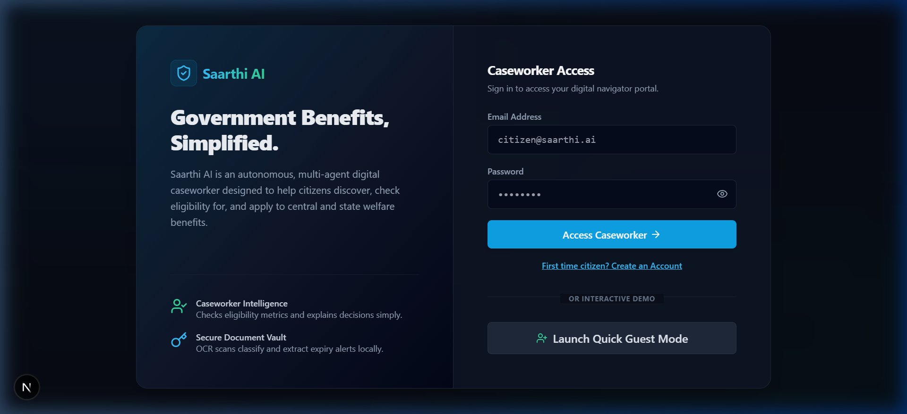
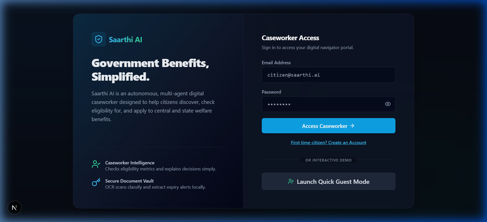
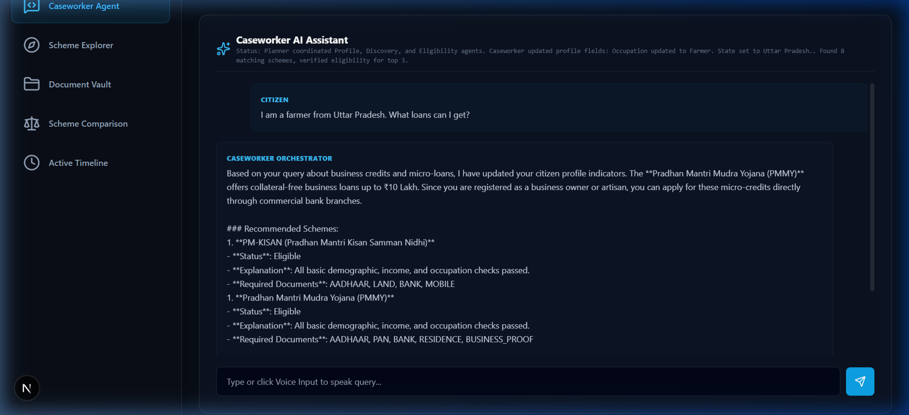
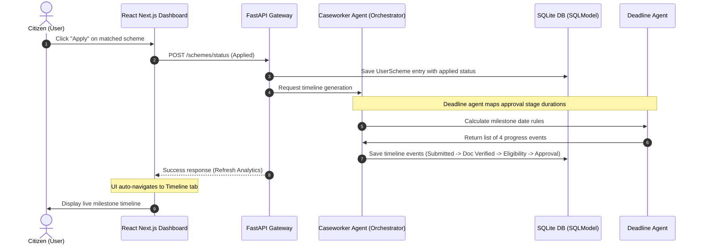
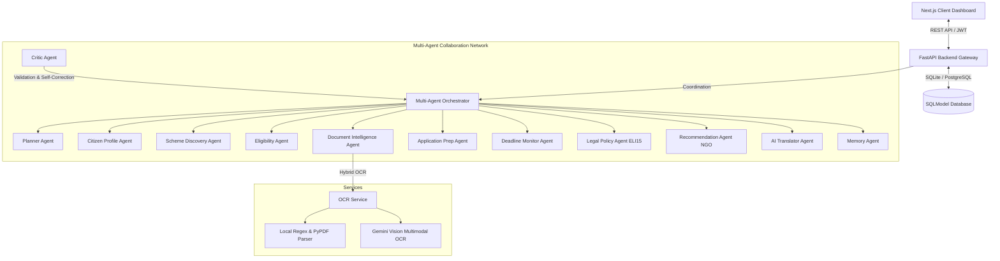

# Saarthi AI – Government Benefits Navigator Portal

Saarthi AI is an enterprise-grade, AI-native multi-agent platform designed to act as an autonomous digital caseworker for citizens seeking government welfare benefits. It empowers users to build structured demographic profiles, discover central government schemes, verify eligibility with detailed reasoning traces, scan files in a secure document vault with hybrid OCR, and generate step-by-step application timelines.

---

## 🌐 Live Demo

Experience the live deployed platform:
* **Frontend Portal (Vercel)**: [https://saarthi-ai-dev.vercel.app](https://saarthi-ai-dev.vercel.app)
* **Backend API Gateway (Render)**: [https://saarthi-ai-ztrc.onrender.com](https://saarthi-ai-ztrc.onrender.com)

---

## ✨ Application Screenshots

### 1. Welcome Onboarding Landing Page
A clean, welcoming landing page enabling guest sessions, setting language preferences, and onboarding citizens into the digital casework environment.


### 2. Analytics Dashboard & Profile Optimizer
An interactive simulation matrix calculating scheme matches instantly upon profile variations (State residency, Age, Category, Annual income). Includes interactive breakdown charts.


### 3. Caseworker AI Assistant Panel
An advanced chat advisor collaborating with orchestrator agents in the background to answer queries, draft cover letters, and suggest schemes.


---

## ⚙️ Citizen Journey & Multi-Agent Workflow

The system relies on a **Planner-Critic-Reflection** pattern, distributing tasks among 10 cooperative background agents. Below is the workflow triggered when a citizen interacts with the portal:



### Specialized Cooperative Agent Roles:
1. **Planner Agent**: Schedules validation sequences.
2. **Citizen Profile Agent**: Formulates demographic vectors from chat context.
3. **Scheme Discovery Agent**: Queries databases for rules-based filter matches.
4. **Eligibility Agent**: Performs strict fine-print checks (e.g. state-specific rules and age restrictions).
5. **Document Intelligence Agent**: Triggers OCR engines, checking document expiration and duplicates.
6. **Application Prep Agent**: Drafts formal cover letters in plain text or markdown.
7. **Deadline Monitor Agent**: Computes stage durations and schedules milestone logs.
8. **Legal Policy Agent (ELI15)**: Simplifies dense legal rules into citizen-comprehensible text.
9. **Recommendation Agent (NGO/Coop)**: Suggests community schemes and direct local helpdesks.
10. **Translator Agent**: Automatically localizes texts into English and Hindi dynamically.

---

## 🏗️ System Architecture



---

## 📂 Directory Structure

```
saarthi-ai/
├── .github/
│   └── workflows/
│       └── ci.yml           # GitHub Actions CI workflow
├── backend/
│   ├── app/                 # Multi-agent implementation
│   │   ├── agents/          # Agent orchestration classes
│   │   ├── core/            # Security, database, configuration
│   │   ├── routes/          # FastAPI routers
│   │   ├── services/        # Auxiliary services (OCR parser)
│   │   ├── models.py        # SQLModel schemas
│   │   └── main.py          # FastAPI application entrypoint
│   ├── tests/               # pytest test suite
│   ├── requirements.txt     # Python packages
│   └── Dockerfile
├── frontend/
│   ├── app/                 # Next.js App Router
│   ├── components/          # React Components (Vault, Simulator, Accessibility)
│   ├── public/              # Static assets
│   │   └── images/          # Illustration graphics
│   ├── package.json
│   └── Dockerfile
├── images/                  # Project screenshots (used in README)
│   ├── landing_page.png
│   ├── dashboard_overview.png
│   └── chat_assistant_dark.png
├── docker-compose.yml
└── README.md
```

---

## 🧪 CI/CD Workflows

This project includes a **GitHub Actions CI Pipeline** configured in `.github/workflows/ci.yml`. On every `push` and `pull_request` to the `main` or `master` branches, the runner:
1. Sets up Python, installs dependencies, and runs the backend unit test suite (`pytest`).
2. Sets up Node.js, installs frontend packages (`npm ci`), and runs `npm run build` to validate React/Next.js syntax and configuration.

---

## 🚀 Local Setup & Quickstart

### Prerequisites
* Python 3.11+
* Node.js 20+
* npm

### 1. Setup Backend
1. Open a terminal in the `backend/` directory.
2. Initialize virtual environment and install packages:
   ```bash
   python -m venv venv
   .\venv\Scripts\activate  # Windows
   pip install -r requirements.txt
   ```
3. Set environment variables in the `.env` file:
   ```
   DATABASE_URL=sqlite:///./saarthi.db
   SECRET_KEY=super-secret-key-change-it-in-production-123456789
   ENVIRONMENT=development
   GEMINI_API_KEY=your_gemini_api_key  # Optional: for live Gemini LLM & Vision OCR
   ```
4. Start the FastAPI development server:
   ```bash
   uvicorn app.main:app --reload --port 8000
   ```
   *The SQLite database will automatically initialize and seed standard Indian Central welfare schemes on startup.*

### 2. Setup Frontend
1. Open a new terminal in the `frontend/` directory.
2. Configure your environment variables in `.env` (by default, the application fallback is set to the deployed Render backend `https://saarthi-ai-ztrc.onrender.com`).
3. Build and launch Next.js in development mode:
   ```bash
   npm run dev
   ```
4. Open `http://localhost:3000` in your web browser. Note that the live production frontend is deployed on Vercel at [https://saarthi-ai-dev.vercel.app](https://saarthi-ai-dev.vercel.app).

---

## 🐳 Running with Docker Compose

To run the entire platform with containerized services locally:
```bash
docker-compose up --build
```
This launches the backend locally on `http://localhost:8000` (live production backend is on Render: `https://saarthi-ai-ztrc.onrender.com`) and the Next.js portal locally on `http://localhost:3000` (live production frontend is on Vercel: `https://saarthi-ai-dev.vercel.app`).

---

## ☁️ Deployment

* **Frontend**: Hosted on Vercel ([https://saarthi-ai-dev.vercel.app](https://saarthi-ai-dev.vercel.app))
* **Backend**: Hosted on Render ([https://saarthi-ai-ztrc.onrender.com](https://saarthi-ai-ztrc.onrender.com))
* **Communication**: The frontend communicates with the deployed backend using environment variables (specifically `NEXT_PUBLIC_API_URL` pointing to the Render URL).
